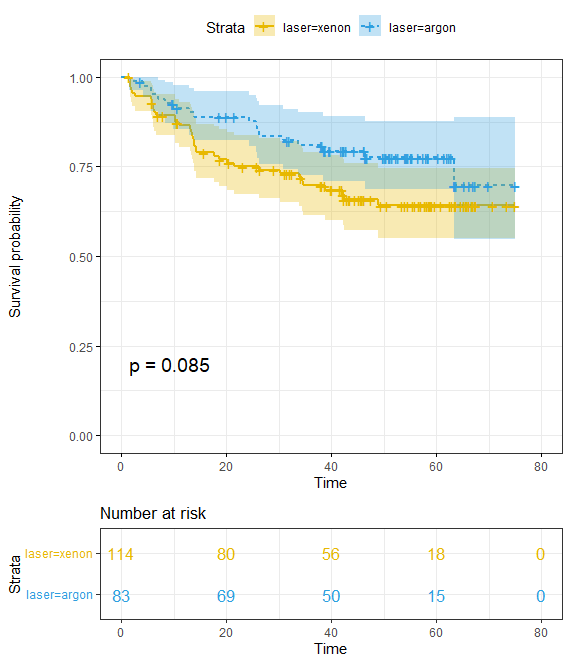

# Can-You-Go-Blind-From-Laser-Eye-Surgery
Survival Analysis on the patients from a trial of laser coagulation for the treatment of diabetic retinopathy. Survival times in this dataset are actual time to blindness in months, minus the minimum possible time to event (6.5 months).

**Experiment Details**
  
The 197 patients in this dataset were a 50% random sample of the patients with "high-risk" diabetic retinopathy as defined by the Diabetic Retinopathy Study (DRS). Each patient had one eye randomized to laser treatment and the other eye received no treatment. For each eye, the event of interest was the time from initiation of treatment to the time when visual acuity dropped below 5/200 two visits in a row. Thus there is a built-in lag time of approximately 6 months (visits were every 3 months). Survival times in this dataset are therefore the actual time to blindness in months, minus the minimum possible time to event (6.5 months). Censoring was caused by death, dropout, or end of the study.

**Dataset description**
  
A data frame with 394 observations on the following 8 variables.
  
<table>
<tr><th>Column Name</th><th>Description</th></tr>
<tr><td>id</td><td>subject id</td></tr>
<tr><td>laser</td><td>laser type: xenon or argon</td></tr>
<tr><td>age</td><td>age at diagnosis</td></tr>
<tr><td>eye</td><td>a factor with levels of left right</td></tr>
<tr><td>trt</td><td>treatment: 0 = no treatment, 1= laser</td></tr>
<tr><td>risk</td><td>risk group of 6-12</td></tr>
<tr><td>time</td><td>time to event or last follow-up</td></tr>
<tr><td>status</td><td>status of 0= censored or 1 = visual loss</td></tr>
</table>

**Analysis**
  
The average time of visual loss for the patients treated with Xenon laser was ~54.76 and the average time of visual loss for the patients who were treated with Argon laser was ~61.76.

  
<table>
<tr><th>Categories</th><th>Records</th><th>n.max</th><th>events</th><th>se(rmean)</th></tr>
<tr><td>Xenon</td><td>114</td><td>114</td><td>114</td><td>36</td><td>54.76</td><td>2.78</td></tr>
<tr><td>Xenon</td><td>83</td><td>83</td><td>83</td><td>18</td><td>61.76</td><td>2.77</td></tr>
</table>

  

 
From the above curve we can observe that there is difference in the survival time of people who were treated with Xenon or Argon laser. 
  

**Log-Rank test**
  
The log-rank test resulted in a difference of Chisquared value 3 and a P-Value of 0.09, which is not significant. 

